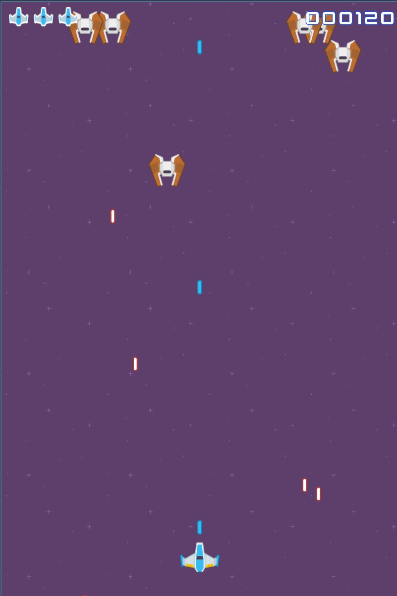
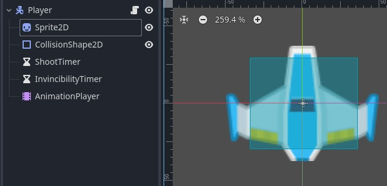
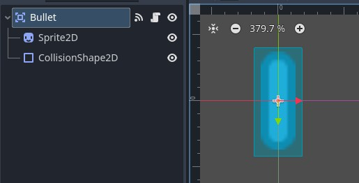
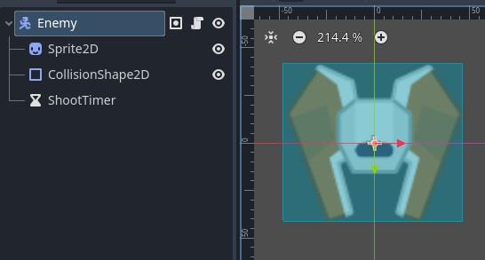
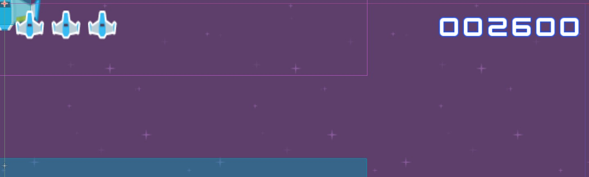
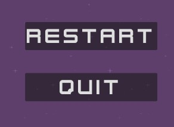
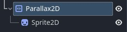
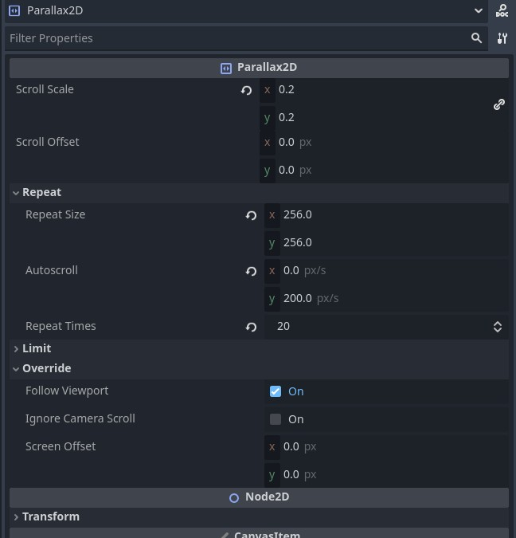

# Space Shooter 2D

L'objectif de ce TD est de créer un space shooter très simple, pour voir les bases des projets en 2D au sein de Godot. 
Certaines assets vous sont fournies de base.

---

## 1. Scène principale

- Créer la scène **`MainScene`** (`Node2D`)  
- Ajouter une **`Camera2D`** et la configurer pour une **taille d’écran mobile** (ex. 720×1280) 

---

## 2️. Scène Joueur

- Créer la scène **`Player`** (`CharacterBody2D`)  
- Ajouter un **sprite** pour représenter le vaisseau  
- Faire bouger le joueur :
  - **Flèches du clavier** pour le bureau  
  - **Clic ou touch** : le joueur se déplace sur l’axe **X** pour suivre la position du pointeur/doigt **tant que le clic est maintenu**  
- Ajouter des **points de vie** au joueur, et une fonction pour prendre des dégâts
- Notre player sera sur le layer de collision **1**, que vous pouvez renommer en Player. Il collisionnera avec les layers **2 & 3**

---

## 3️. Scène Projectile

- Créer la scène **`Bullet`** (`Area2D`)  
- Ajouter le sprite
- Nous utiliserons cette scène de manière héritée pour faire les projectiles des ennemis, pensez donc à mettre une variable pour identifier si le projectile appartient au joueur ou à un ennemi.
- Ajouter le déplacement du projectile: vers le haut s'il est joueur, vers le bas s'il est ennemi
- Gérer la détection des collisions. Le layer des projectile sera le layer **3**, ils collisionneront avec les layers **1 2 et 3**
- Dans la scène **Player** :
  - Faire en sorte que le joueur tire automatiquement selon un intervalle de temps réglable depuis l'éditeur

---

## 4️. Scène Ennemi

- Créer la scène **`Enemy`** (`CharacterBody2D`)  
- Comportement :
  - Arrive **depuis le haut de l’écran**. Un enemi spawn en dehors de l'écran, et il doit arriver vite au sein de l'écran avant d'exécuter son pattern de déplacement.
  - Se déplace selon **un pattern spécifique** lorsqu’il est visible (latéralement sur l'écran, selon une courbe sinusoidale, statique)  
  - Faite tirer l'ennemi automatiquement selon un intervalle de temps, comme le player. 

---

## 5. UI : Vie & Score

- Afficher les **points de vie du joueur** (Une image avec un xZ, ou Z est le nombre de vie restantes au joueur, ou alors comme sur l'exemple plus haut)
- Afficher le **score**, mis à jour à chaque ennemi détruit  
- Créer un **GameManager** pour stocker le score. Nous nous en resservirons plus tard

---

## 6. Boutons Restart & Quit

- Ajouter les boutons **Redémarrer** et **Quitter**  
- Affichés lorsque la **vie du joueur atteint 0**

---

## 7. Parallax background

- Ajouter un parallax background grâce au node Parallax2D. Créez un node Sprite2D enfant de ce nouveau node, et mettez y le background que vous souhaitez.
- Régler le parallax de la manière que vous le souhaitez.

---

## 8. Effets visuels (Juice & Polish)

- Ajouter un **shake de caméra** quand le joueur est touché  
- Implémenter **un temps d’invincibilité** et une animation après avoir été touché  
- Au **Game Over** :
  - Stopper tous les mouvements via `GameManager.is_running`  
  - Jouer un **gros shake de caméra**  
  - Afficher les boutons **Redémarrer/Quitter**

---

## 9. Améliorations

On pourrait ajouter des astéroides qui traversent l'écran et menace le player.
Le player pourrait se déplacer également sur l'axe Y, dans le premier tiers de l'écran seulement. 
On peut ajouter des powerup (vitesse accéléré, cadence de tir augmentée, projectiles modifiés...)
On pourrait ajouter une animation supplémentaire lorsqu'on détruit un enemi, pour plus de juice